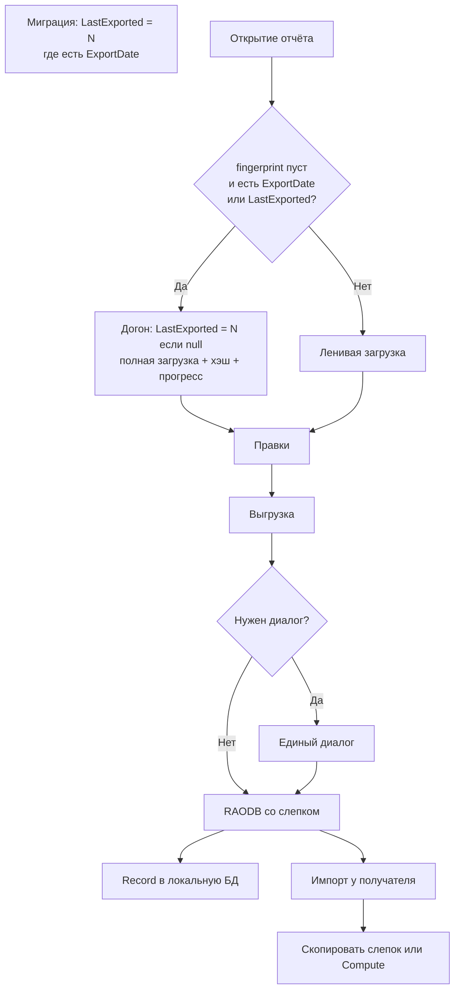

# Напоминание о номере корректировки при выгрузке (финальный план)

## Цель

- При выгрузке `.RAODB`, если тот же номер корректировки и содержимое изменилось после последнего слепка — диалог: **повысить и сохранить** / **оставить номер** / **отмена**.
- Одна функция **для всех** (организация, РИАЦ, НОРАО). Тумблеры роли не вводим.
- Без автоповышения. Дефолт кнопки — **оставить номер** (чтобы РИАЦ при правке чужого отчёта случайно не занял следующий N).
- После апдейта программы напоминание на **первой** выгрузке после правок уже выгружавшегося отчёта (догон слепка при открытии).
- Черновик без `ExportDate` не эталонируем (первая регламентная выгрузка без ложного диалога).

## Поля

В [Report.cs](Models/Collections/Report.cs) (ездят в `.RAODB`, без `[FormProperty]`):

```csharp
public byte? LastExportedCorrectionNumber_DB { get; set; }

[MaxLength(64)]
public string? LastExportedContentFingerprint_DB { get; set; }  // VARCHAR(64), не BLOB
```

`ExportDate` — как сейчас (UI/файл/импорт); в условие диалога не входит, в тексте можно показать.

Миграция после `RemoveCorrectionNumFromForms2`, только через `MigrateDatabase*`:

```sql
UPDATE "ReportCollection_DbSet"
SET "LastExportedCorrectionNumber_DB" = "CorrectionNumber_DB"
WHERE "ExportDate_DB" IS NOT NULL AND "ExportDate_DB" <> '';
-- fingerprint остаётся NULL
```

---

## Жизненный цикл слепка



| Событие | Слепок |
|--------|--------|
| Миграция | `LastExported = CorrectionNumber` при непустом `ExportDate`; fingerprint NULL |
| Открытие, догон | fingerprint NULL **и** (`ExportDate` не пуст **или** `LastExported` задан): при null `LastExported = CorrectionNumber`; полная загрузка; Compute; Save. Дальше — лениво |
| Открытие иначе | fingerprint есть **или** черновик без `ExportDate`/`LastExported` — не трогать |
| Успешная выгрузка | В **файл и** локальную БД: текущий N + Compute (после `File.Copy` на tracked) |
| Импорт | Поля из файла; если fingerprint NULL — Compute по уже загруженным строкам, `LastExported = CorrectionNumber`. Не обнулять «на открытие» |
| Старт приложения | Ничего |

---

## Правило Evaluate (диалог)

Показать диалог только если:

1. `LastExportedCorrectionNumber_DB` задан;
2. `CorrectionNumber_DB == LastExportedCorrectionNumber_DB`;
3. `LastExportedContentFingerprint_DB` не null;
4. `Compute(current) !=` сохранённому.

Иначе без диалога (первая сдача черновика; или выгрузка после миграции без открытия — после успеха просто Record).

### Текст и кнопки (для всех ролей)

1. **Повысить до N+1, сохранить и выгрузить**
2. **Выгрузить с номером N** (`IsDefault`)
3. **Отмена**

Текст (кратко; правила — **жирным** / выделенным блоком):

> Отчёт уже выгружался с номером корректировки **N**. Содержимое изменилось (дата выгрузки: …).
>
> **Правила:**
> - **Организация** при изменениях номер **повышать необходимо**.
> - **РИАЦ готовит отчёт за организацию** в программе (организация `.RAODB` не присылала) — при изменениях номер **повышать нужно**.
> - **РИАЦ только устранял ошибки** в отчёте, который организация уже вела в программе, — номер **повышать нельзя**.

Пакетная выгрузка: один сводный диалог + тот же блок правил. Отдельный текст для Norao не делаем.

---

## Fingerprint: актуальность и реализация

### Оркестратор

[Models/Collections/ReportContentFingerprint.cs](Models/Collections/ReportContentFingerprint.cs) (или `Models/Comparers/…`):

- префикс алгоритма `v1`;
- шапка Report;
- строки по `NumberInOrder` → `ContributeToContentFingerprint`;
- Notes → `Contribute…`;
- SHA-256 hex 64.

**Не** держать в этом файле списки полей Form11/Form21.

### Строки и Notes

В [Form.cs](Models/Forms/Form.cs) / [Note.cs](Models/Forms/Note.cs):

```csharp
public abstract void ContributeToContentFingerprint(ContentFingerprintSink sink);
```

Реализации **рядом** с `IsContentEqual`, те же поля и те же нормализаторы (`FormTextEquality`, даты, экспонента…). Правка сравнения содержимого = правка вклада в хэш в том же PR.

### Шапка Report

Все mapped скалярные `*_DB`, **кроме явного exclude**:

Exclude (минимум): `Id`, FK, `CorrectionNumber_DB`, `ExportDate_DB`, `LastExportedCorrectionNumber_DB`, `LastExportedContentFingerprint_DB`, при необходимости `NumberInOrder_DB` / служебное.

Новое поле в Report, не добавленное в exclude → само попадает в хэш. Сознательно «не в хэш» → только через exclude + комментарий.

### Guard-тесты (`Test/Architecture` или `Test/ReportExport`)

1. Для каждого типа Form/Note: набор `*_DB` в `IsContentEqual` == набор в `ContributeToContentFingerprint` (разбор исходников или согласованный контракт).
2. `IsContentEqual == true` ⇒ одинаковый вклад; `false` ⇒ разный (фикстуры).
3. Каждый mapped `*_DB` у `Report` либо участвует в хэше шапки, либо явно в exclude-листе — иначе красный тест.
4. Смена состава/нормализации → bump `v1`→`v2`; при необходимости миграция обнуления fingerprint или принять один цикл ложных диалогов.

---

## Сервис и интеграция

[Client_App/Services/ReportExportSnapshotService.cs](Client_App/Services/ReportExportSnapshotService.cs):

- `Evaluate` / `PromptAsync` (единый текст) / `RecordSuccessfulExport` / `ApplyFromImport` / `EnsureSnapshotOnOpenAsync`

### Выгрузка

[ExportReportAsyncCommand.cs](Client_App/Commands/AsyncCommands/RaodbExport/ExportReportAsyncCommand.cs), [ExportReportsAsyncCommand.cs](Client_App/Commands/AsyncCommands/RaodbExport/ExportReportsAsyncCommand.cs):

1. После загрузки строк — Evaluate → Prompt.
2. Повысить → `CorrectionNumber++`, SaveChanges.
3. В граф temp `.RAODB` **включить** слепок этой выгрузки (оба поля).
4. После успешного `File.Copy` — Record на **tracked** + SaveChanges.

Excel / JSON / закрытие формы — не трогаем.

### Импорт

[ImportBaseAsyncCommand.cs](Client_App/Commands/AsyncCommands/Import/ImportBaseAsyncCommand.cs): `ApplyFromImport` при замене/добавлении со строками (не ClearSnapshot).

### Открытие

После контекста отчёта (с учётом ленивой пагинации): `EnsureSnapshotOnOpenAsync` по правилам выше; прогресс открытия общий, для догона — статусы «строки N из M» / «сохранение снимка».

---

## Тесты функциональные

- Fingerprint: стабильность; правка строки → другой хэш; смена только N → тот же.
- Evaluate: нет слепка / тот же N+другой хэш / совпал / N повышен.
- ApplyFromImport: копия из файла; NULL → Compute.
- EnsureOnOpen: с `ExportDate` — пишет; без — нет; fingerprint есть — не полная догрузка ради слепка.

---

## Вне объёма

- Автоинкремент; запрет выгрузки с тем же N.
- Диалог при каждом save/закрытии редактора.
- `LastExportedAt_DB`; COUNT / bootstrap при старте; «мелкая/крупная».
- Тумблеры РИАЦ/ВИАЦ/организация; разный текст для Norao.
- Изменение политики приёма орг↔РЦ (сравнение отчётов уже есть).
