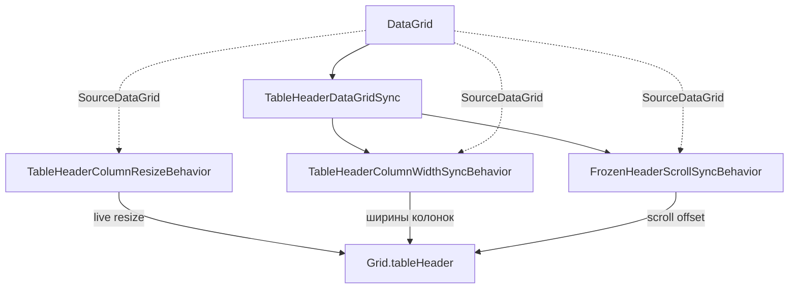

# Behaviors (`Client_App/Behaviors`)

Avalonia behaviors и attached properties для форм отчётности. Реализация разнесена по подпапкам; в **корне** остаются только **shim-классы** для совместимости со старым XAML (`xmlns:local="using:Client_App.Behaviors"`).

> **Не путать** с `Client_App/Controls/DataGrid` — это старый кастомный DataGrid для форм 2.x.

## Структура папок

```
Behaviors/
├── TableHeader/          → Client_App.Behaviors.TableHeader
├── DataGrid/             → Client_App.Behaviors.DataGridBehaviors   (*)
├── Input/                → Client_App.Behaviors.Input
├── WindowSizing/         → Client_App.Behaviors.WindowSizing
├── Controls/             → Client_App.Behaviors.Controls
└── *.cs (корень)         → Client_App.Behaviors — только shims
```

(\*) Namespace называется `DataGridBehaviors`, а не `DataGrid`, чтобы не конфликтовать с типом `Avalonia.Controls.DataGrid`.

### TableHeader — кастомная шапка таблицы

| Файл | Назначение |
|------|------------|
| `FrozenHeaderScrollSyncBehavior` | Горизонтальный скролл шапки вместе с DataGrid |
| `TableHeaderColumnWidthSyncBehavior` | Ширины колонок шапки ↔ DataGrid |
| `TableHeaderColumnResizeBehavior` | Перетаскивание границ колонок в шапке |
| `TableHeaderDataGridSync` | Внутренний координатор (не вешается в XAML) |
| `TableHeaderColumnWidth` | Вспомогательные расчёты ширин |

### DataGrid — стандартный `Avalonia.Controls.DataGrid`

| Файл | Назначение |
|------|------------|
| `DataGridPointerBehavior` | Единая точка для PointerMoved (drag-select, фокус TextBox) |
| `DataGridSelectedItemsBehavior` | Привязка `SelectedItems` |
| `DataGridEditingStateBehavior` | Флаг `IsEditing` |
| `DataGridAlternateArrowsKeyBehavior` | Стрелки при редактировании |
| `DataGridForm1AutoReplaceBehavior` | Автозамена (только формы 1.x) |
| `DataGridColumnWidthLoadBehavior` | Сохранение/загрузка ширин колонок |
| `DataGridClearSelectionOnEmptyAreaClickBehavior` | Сброс выделения по клику в пустую область грида |
| `DataGridClearSelectionOnOutsideClickBehavior` | Сброс выделения по клику вне грида |
| `DataGridSwitchToNotesBehavior` | Переключение на вкладку примечаний |
| `DataGridDoubleClickOpenFormBehavior` | Открытие формы по двойному клику (tab controls) |
| `DataGridSortingBehavior` | Кастомная сортировка (окна проверки) |

Старые имена (только shim в корне): `DataGridDeselectOnEmptyAreaClickBehavior`, `DeselectDataGridOnClickOutsideBehavior`, `ColumnWidthSyncBehavior`.

### Input — поля ввода

| Файл | Назначение |
|------|------------|
| `AutoCompleteBoxValidationBehavior` | Валидация AutoCompleteBox |
| `AutoCompleteBoxSelectionChangedBehavior` | Обработка выбора в AutoCompleteBox |
| `TextBoxDigitValidationBehavior` | Только цифры (NumericLeftRight) |
| `TextBoxAutoTrim` | Обрезка пробелов при потере фокуса (глобальный стиль в `App.axaml`) |

### WindowSizing — размер окон

| Файл | Назначение |
|------|------------|
| `WindowScreenSizeBehavior` | `WidthRatio` / `HeightRatio` относительно рабочей области экрана |

### Controls — кнопки и скролл

| Файл | Назначение |
|------|------------|
| `ScrollBlock` + `BlockPointerWheelBehavior` | Блокировка колёсика мыши (`App.axaml`, CalendarDatePicker) |
| `DropDownButtonBehavior` | Кастомная кнопка-выпадашка |
| `YearPickerButtonBehavior` | Выбор года на кнопке (attached properties) |

## Префиксы в XAML (формы 1.1–1.9)

```xml
xmlns:headerBehaviors="using:Client_App.Behaviors.TableHeader"
xmlns:dgBehaviors="using:Client_App.Behaviors.DataGridBehaviors"
xmlns:inputBehaviors="using:Client_App.Behaviors.Input"
xmlns:windowSizingBehaviors="using:Client_App.Behaviors.WindowSizing"
xmlns:controlBehaviors="using:Client_App.Behaviors.Controls"
```

`xmlns:local="using:Client_App.Behaviors"` в новых формах 1.x не обязателен — behaviors подключаются через префиксы выше.

## Стек TableHeader (формы 1.x)

Кастомная шапка (`Grid.tableHeader`) работает **рядом** со стандартным DataGrid, а не вместо него.



**Порядок подключения на шапке:** `FrozenHeaderScrollSyncBehavior` → `TableHeaderColumnWidthSyncBehavior` → `TableHeaderColumnResizeBehavior` (на вложенных `Grid` шапки — по месту, см. `Form_11.axaml`).

## Стандартный набор behaviors

### Основная таблица — формы 1.1–1.9

На `DataGrid` с данными формы:

```xml
<interactivity:Interaction.Behaviors>
    <dgBehaviors:DataGridColumnWidthLoadBehavior FormNum="1.1" />
    <dgBehaviors:DataGridPointerBehavior />
    <dgBehaviors:DataGridSelectedItemsBehavior SelectedItems="{Binding SelectedForms, Mode=TwoWay}" />
    <dgBehaviors:DataGridClearSelectionOnEmptyAreaClickBehavior />
    <dgBehaviors:DataGridEditingStateBehavior IsEditing="{Binding DataGridIsEditing, Mode=TwoWay}" />
    <dgBehaviors:DataGridAlternateArrowsKeyBehavior IsEditing="{Binding DataGridIsEditing, Mode=OneWay}" />
    <dgBehaviors:DataGridForm1AutoReplaceBehavior />
</interactivity:Interaction.Behaviors>
```

На `AutoCompleteBox` в ячейках:

```xml
<inputBehaviors:AutoCompleteBoxValidationBehavior ... />
<inputBehaviors:AutoCompleteBoxSelectionChangedBehavior />
```

### Таблица примечаний — формы 1.1–1.9

```xml
<interactivity:Interaction.Behaviors>
    <dgBehaviors:DataGridColumnWidthLoadBehavior FormNum="notes" />
    <dgBehaviors:DataGridPointerBehavior />
    <dgBehaviors:DataGridSelectedItemsBehavior SelectedItems="{Binding SelectedNotes, Mode=TwoWay}" />
    <dgBehaviors:DataGridSwitchToNotesBehavior SourceDataGrid="{Binding #dataGrid}" />
    <dgBehaviors:DataGridClearSelectionOnEmptyAreaClickBehavior />
</interactivity:Interaction.Behaviors>
```

### Tab controls (`Forms1TabControl` … `Forms5TabControl`)

На списковых DataGrid:

```xml
<dgBehaviors:DataGridDoubleClickOpenFormBehavior />
<dgBehaviors:DataGridClearSelectionOnEmptyAreaClickBehavior />
```

### Формы 2.x / 4.x / 5.x (legacy, без правок XAML)

Используют `xmlns:local="using:Client_App.Behaviors"` и старые имена классов из **корня** (shims). Реализация та же, что в подпапках.

Пример shim:

```csharp
public class DataGridPointerBehavior : DataGridBehaviors.DataGridPointerBehavior;
public class ColumnWidthSyncBehavior : TableHeader.TableHeaderColumnWidthSyncBehavior;
```

## Глобальные стили (`App.axaml`)

| Стиль | Behavior |
|-------|----------|
| `CalendarDatePicker.buttonOnly` | `controlBehaviors:ScrollBlock.BlockPointerWheel` |
| `TextBox` | `inputBehaviors:TextBoxAutoTrim.IsEnabled` |

Диалоги и часть окон по-прежнему используют `behaviors:WindowScreenSizeBehavior` через shim в корне; новые окна можно подключать через `windowSizingBehaviors:`.

## Добавление behavior в новую форму 1.x

1. Скопировать блок `xmlns` и `Interaction.Behaviors` с ближайшей формы (например, `Form_11.axaml`).
2. Подставить свой `FormNum` в `DataGridColumnWidthLoadBehavior`.
3. Не использовать `Client_App/Controls/DataGrid` — только `Avalonia.Controls.DataGrid` + behaviors из этой папки.

## Удаление shim-слоя (в будущем)

Корневые `*.cs` можно удалить, когда:

- все XAML переведены на префиксы подпапок, **или**
- формы 2.x / 4.x / 5.x сняты с поддержки.

После этого в `Behaviors/` останутся только подпапки с реализацией.
